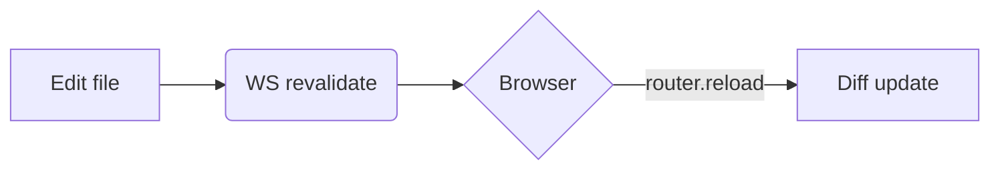

## GitHub Flavored Markdown

テーブル、タスクリスト、打ち消し線、オートリンクがすべて使えます。

```md
| Feature | Status |
| --- | --- |
| Tables | done |
| ~~Strikethrough~~ | done |

- [x] Compatible with GitHub web
- [ ] More to come
```

以下のように表示されます。

| Feature | Status |
| --- | --- |
| Tables | done |
| ~~Strikethrough~~ | done |

- [x] Compatible with GitHub web
- [ ] More to come

## GitHub 形式のアラート

GitHub の `> [!NOTE]` 記法は、fumadocs のコールアウトに変換されます。

```md
> [!NOTE]
> Useful information that complements the prose.

> [!TIP]
> Suggestions to make things easier.

> [!IMPORTANT]
> Information users need to know.

> [!WARNING]
> Things that can go wrong.

> [!CAUTION]
> Negative consequences if ignored.
```

以下のように表示されます。

> [!NOTE]
> Useful information that complements the prose.

> [!TIP]
> Suggestions to make things easier.

> [!IMPORTANT]
> Information users need to know.

> [!WARNING]
> Things that can go wrong.

> [!CAUTION]
> Negative consequences if ignored.

## コードブロック

フェンスドコードブロックは Shiki でハイライトされます。文法は必要になったときに読み込まれるので、実際に使う言語の分だけが取り込まれます。

````md
```ts
export function greet(name: string) {
  return `Hello, ${name}`;
}
```
````

以下のように表示されます。

```ts
export function greet(name: string) {
  return `Hello, ${name}`;
}
```

サポートされていない言語は `text` として扱います。

### コードタブ

`tab="…"` を付けると、関連するコードブロックをタブにまとめられます。

````md
```ts tab="TypeScript"
const x: number = 1;
```

```js tab="JavaScript"
const x = 1;
```
````

以下のように表示されます。

```ts tab="TypeScript"
const x: number = 1;
```

```js tab="JavaScript"
const x = 1;
```

### パッケージマネージャーのタブ

`npm install …` で始まるスニペットは、npm / pnpm / yarn / bun のタブに自動で展開されます。

````md
```npm
npm install fumadocs-core
```
````

以下のように表示されます。

```npm
npm install fumadocs-core
```

選んだマネージャーは、ページをまたいでも覚えています。

## Mermaid

フェンスドコードブロックの言語に `mermaid` を指定するだけです。

````md

````

以下のように表示されます。


## 数式（KaTeX）

インラインの数式は `$…$`、ブロックの数式は `$$…$$` で書きます。

```md
The relationship is $E = mc^2$.

$$
\int_0^\infty e^{-x^2}\,dx = \frac{\sqrt{\pi}}{2}
$$
```

以下のように表示されます。

The relationship is $E = mc^2$.

$$
\int_0^\infty e^{-x^2}\,dx = \frac{\sqrt{\pi}}{2}
$$

## 画像とアセット

ドキュメントツリー内のファイルへの相対パスは、リクエストに応じて配信されます。画像や静的ファイルはそのまま表示されます。

```md

```

以下のように表示されます。


HTML プロトタイプ、PDF、スクリプトといった Markdown 以外のファイルも同様です。これらへのリンクは新しいタブで開きます。動画や音声（`.mp4`、`.webm`、`.mp3` など）は適切なコンテンツタイプと Range リクエストに対応した形で配信されるので、ダウンロードされずにブラウザ上で再生・シークできます。

```md
[Open the prototype](./prototypes/login.html)
[Download the spec](./spec.pdf)
[Watch the demo](./demo.mp4)
```

試してみましょう。[ログインプロトタイプを開く](./prototypes/login.html)。これは隣に `login.css` を置いただけの HTML ファイルです。

sladocs はパスをページからの相対で解決し、`/api/asset/…` の下で配信します。配信される URL は元のディレクトリ構造を保つため、HTML の内部にある相対参照（`./login.css` など）も正しく解決されます。

解決できるのは相対パスだけです。これにより、同じリンクが GitHub 上でも生きたままになります。絶対 URL（`https://…`）は手を加えずにそのまま通し、プロジェクトディレクトリの外へパスがはみ出すことはありません。

また、プロジェクト配下のすべてを配信するわけではありません。アセットには、ページを集めるときと同じ除外ルールが適用されます。git で無視されるファイル、`.git` ディレクトリ、ドットで始まる名前のファイル（`.env` など）は 404 を返します。シンボリックリンクは、リンク先がプロジェクト内に収まる場合だけたどります。リンクした画像が思いがけず 404 を返すときは、`.gitignore` に引っかかっていないか確認してください。こうしたルールがあるおかげで、LAN プレビュー（`-H 0.0.0.0`）でドキュメント外のファイルが見えてしまう心配がありません。

> [!NOTE]
> アセットはリクエストのたびに読み直しますが、編集してもホットリロードは起きません（ホットリロードの対象は、集めたページ — `.md`、`.mdx` — と `meta.json` だけです）。変更を反映するにはブラウザを再読み込みしてください。

## ページ間のリンク

ほかの Markdown ファイルへの相対リンクは、そのページの URL に解決されます。同じリンクが sladocs でも GitHub でもそのまま機能します。

```md
See the [configuration guide](./configuration.md).
```

`.md` / `.mdx` の拡張子は取り除かれ、リンクはサイト内の移動になります。アンカー（`#section`）や外部 URL は、書いたとおりに動きます。

## 見出しと目次

見出しは自動でスラッグ化され（`## My Heading` → `#my-heading`）、右側の目次にまとめられます。設定は不要で、`h2` から `h4` までがすべて対象です。

## インライン HTML

Markdown 内の生の HTML は、GitHub と同じようにレンダリングされます。`<kbd>`、`<sub>`、`<sup>`、`<details>` / `<summary>`、`<mark>`、`<br>`、`<abbr>` といったよく使うタグはそのまま通ります。

```md
Press <kbd>Ctrl</kbd>+<kbd>C</kbd> to copy.

H<sub>2</sub>O and E = mc<sup>2</sup>.

<details>
<summary>Click to expand</summary>

Hidden content with **markdown** inside still works.

</details>
```

GFM のタグフィルターは、危険なタグをレンダリングせずプレーンテキストに変換します。対象は `iframe`、`noembed`、`noframes`、`plaintext`、`script`、`style`、`textarea`、`title`、`xmp` です。これは GitHub の [Disallowed Raw HTML][gfm-disallowed] の挙動と同じです。

[gfm-disallowed]: https://github.github.com/gfm/#disallowed-raw-html-extension-

この挙動は [`markdown.allowDangerousHtml`](./configuration.ja.md#markdown) で調整できます。

- `"safe"`（既定） — 上で説明した GFM のタグフィルター。
- `"off"` — 生の HTML をすべて取り除き、Markdown の記法だけを反映します。
- `"all"` — フィルターなし。`<script>` や `<iframe>` も実行されるので、信頼できるソースに対してだけ使ってください。

## `.mdx` ファイル

`.mdx` ファイルも `.md` と並んで集められ、レンダリングされます。ただし扱いは MDX ではなく Markdown です。JSX タグや `import` / `export` 文は評価されません。コンポーネントはレンダリングされず、`import` / `export` の行はただのテキストとして表示されます。

## フロントマター

使えるフィールドは [ナビゲーション](./navigation.ja.md#フロントマター) を参照してください。
