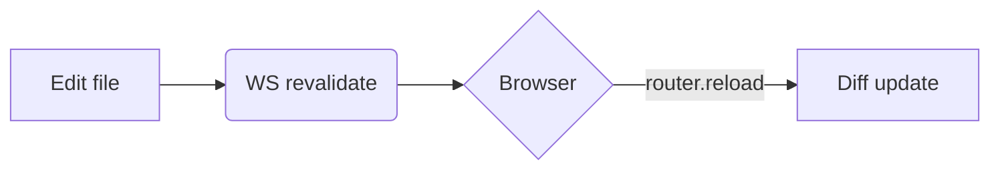
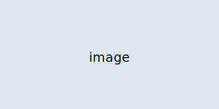

## GitHub Flavored Markdown

Tables, task lists, strikethrough, and autolinks all work.

```md
| Feature | Status |
| --- | --- |
| Tables | done |
| ~~Strikethrough~~ | done |

- [x] Compatible with GitHub web
- [ ] More to come
```

Renders as:

| Feature | Status |
| --- | --- |
| Tables | done |
| ~~Strikethrough~~ | done |

- [x] Compatible with GitHub web
- [ ] More to come

## GitHub-style alerts

The same `> [!NOTE]` syntax used by GitHub is converted into fumadocs callouts.

```md
> [!NOTE]
> Useful information that complements the prose.

> [!TIP]
> Suggestions to make things easier.

> [!IMPORTANT]
> Information users need to know.

> [!WARNING]
> Things that can go wrong.

> [!CAUTION]
> Negative consequences if ignored.
```

Renders as:

> [!NOTE]
> Useful information that complements the prose.

> [!TIP]
> Suggestions to make things easier.

> [!IMPORTANT]
> Information users need to know.

> [!WARNING]
> Things that can go wrong.

> [!CAUTION]
> Negative consequences if ignored.

## Code blocks

Fenced code blocks are highlighted by Shiki. Grammars load lazily, so only the languages you actually use are pulled in.

````md
```ts
export function greet(name: string) {
  return `Hello, ${name}`;
}
```
````

Renders as:

```ts
export function greet(name: string) {
  return `Hello, ${name}`;
}
```

Unknown languages fall back to `text`.

### Code tabs

Add `tab="…"` to group related code blocks into tabs.

````md
```ts tab="TypeScript"
const x: number = 1;
```

```js tab="JavaScript"
const x = 1;
```
````

Renders as:

```ts tab="TypeScript"
const x: number = 1;
```

```js tab="JavaScript"
const x = 1;
```

### Package manager tabs

Snippets that start with `npm install …` automatically expand into npm / pnpm / yarn / bun tabs.

````md
```npm
npm install fumadocs-core
```
````

Renders as:

```npm
npm install fumadocs-core
```

The manager you select is remembered across pages.

## Mermaid

Use the `mermaid` language on any fenced code block.

````md

````

Renders as:


## Math (KaTeX)

Write inline math with `$…$` and block math with `$$…$$`.

```md
The relationship is $E = mc^2$.

$$
\int_0^\infty e^{-x^2}\,dx = \frac{\sqrt{\pi}}{2}
$$
```

Renders as:

The relationship is $E = mc^2$.

$$
\int_0^\infty e^{-x^2}\,dx = \frac{\sqrt{\pi}}{2}
$$

## Images and assets

Relative paths to files within the documentation tree are served on request, so images and static files display as-is.

```md

```

Renders as:


The same applies to non-Markdown files such as HTML prototypes, PDFs, and scripts. Links to these open in a new tab. Video and audio files (`.mp4`, `.webm`, `.mp3`, and so on) are served with the right content type and Range support, so they play — and seek — in the browser instead of downloading.

```md
[Open the prototype](./prototypes/login.html)
[Download the spec](./spec.pdf)
[Watch the demo](./demo.mp4)
```

Try it: [open the login prototype](./prototypes/login.html). It's just an HTML file with `login.css` next to it.

`sladocs` resolves paths relative to the page and serves them under `/api/asset/…`. Because the served URL preserves the actual directory structure, relative references *inside* the HTML (such as `./login.css`) also resolve correctly.

Only relative paths can be resolved, which keeps the same links working on GitHub too. Absolute URLs (`https://…`) are passed through as-is, and paths cannot escape outside the project directory.

Not everything under the project is served, either: assets follow the same exclusion rules as page collection. Git-ignored files, the `.git` directory, and files whose name starts with a dot (`.env` and the like) return 404, and a symlink is followed only if its target stays inside the project. If a linked image unexpectedly returns 404, check whether `.gitignore` covers it. These rules are what keep a LAN preview (`-H 0.0.0.0`) from exposing files that were never meant to be part of the docs.

> [!NOTE]
> Assets are re-read on every request, but editing them does not trigger hot reload (only collected pages — `.md`, `.mdx` — and `meta.json` do). Reload the browser to pick up changes.

## Links between pages

Relative links to other Markdown files resolve to that page's URL, so the same link works in both sladocs and on GitHub.

```md
See the [configuration guide](./configuration.md).
```

The `.md` / `.mdx` extension is stripped and the link navigates within the site. Anchors (`#section`) and external URLs behave exactly as written.

## Headings and table of contents

Headings are slugified automatically (`## My Heading` → `#my-heading`) and gathered into the table of contents on the right. There's no configuration; `h2` through `h4` are all included.

## Inline HTML

Raw HTML in Markdown is rendered just like on GitHub. Handy tags such as `<kbd>`, `<sub>`, `<sup>`, `<details>`/`<summary>`, `<mark>`, `<br>`, and `<abbr>` pass through as-is.

```md
Press <kbd>Ctrl</kbd>+<kbd>C</kbd> to copy.

H<sub>2</sub>O and E = mc<sup>2</sup>.

<details>
<summary>Click to expand</summary>

Hidden content with **markdown** inside still works.

</details>
```

GFM's tag filter escapes unsafe tags to plain text rather than rendering them: `iframe`, `noembed`, `noframes`, `plaintext`, `script`, `style`, `textarea`, `title`, `xmp`. This matches GitHub's [Disallowed Raw HTML][gfm-disallowed] behavior.

[gfm-disallowed]: https://github.github.com/gfm/#disallowed-raw-html-extension-

You can adjust this behavior with [`markdown.allowDangerousHtml`](./configuration.md#markdown).

- `"safe"` (default) — the GFM tag filter described above.
- `"off"` — strips raw HTML entirely, reflecting only Markdown syntax.
- `"all"` — no filter. `<script>` and `<iframe>` will also run, so use only with trusted sources.

## `.mdx` files

`.mdx` files are collected and rendered alongside `.md`, but they are treated as
Markdown — not MDX. JSX tags and `import`/`export` statements are **not**
evaluated: components do not render, and `import`/`export` lines appear as plain
text.

## Frontmatter

See [Navigation](./navigation.md#frontmatter) for the supported fields.
